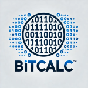

# BitCalc

 <!-- Placeholder for logo, replace with actual URL if available -->

## Overview
BitCalc is a simple and efficient binary calculator designed to perform various binary operations with ease. Whether you're a student, developer, or just someone who needs to work with binary numbers, BitCalc provides an intuitive and user-friendly interface to meet your needs.

## Features
- **Binary Addition:** Perform the addition of binary numbers.
- **Binary Subtraction:** Subtract one binary number from another.
- **Binary Multiplication:** Multiply two binary numbers.
- **Binary Division:** Divide one binary number by another.
- **Bitwise Operations:** AND, OR, XOR, NOT operations.

## Installation
To clone the repository and set up BitCalc on your local machine, follow these steps:
```sh
git clone https://github.com/gvega001/BitCalc.git
cd BitCalc
```markdown
## Usage
Here's how you can use BitCalc:

1. **Binary Addition:**
   ```sh
   ./bitcalc -a 1010 0101  # Output: 1111
   ```

2. **Binary Subtraction:**
   ```sh
   ./bitcalc -s 1010 0101  # Output: 0101
   ```

3. **Binary Multiplication:**
   ```sh
   ./bitcalc -m 1010 0101  # Output: 0101010
   ```

4. **Binary Division:**
   ```sh
   ./bitcalc -d 1010 0101  # Output: 0010
   ```

5. **Bitwise Operations:**
   - AND: `./bitcalc -and 1010 0101`  # Output: 0000
   - OR: `./bitcalc -or 1010 0101`  # Output: 1111
   - XOR: `./bitcalc -xor 1010 0101`  # Output: 1111
   - NOT: `./bitcalc -not 1010`  # Output: 0101

## Contributing
Contributions are welcome! If you'd like to contribute to BitCalc, please fork the repository and use a feature branch. Pull requests are warmly welcome.

## License
This project is licensed under the MIT License - see the [LICENSE](LICENSE) file for details.

## Contact
Created by [gvega001](https://github.com/gvega001) - feel free to contact me!

## Acknowledgments
Thanks to all the open-source projects and contributors who helped make BitCalc possible.
```
